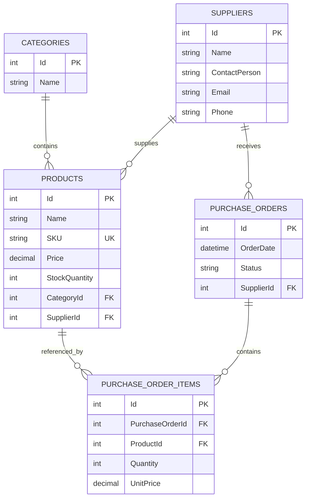

# MiniERP 資料庫 ERD

```mermaid
erDiagram
    CATEGORIES ||--o{ PRODUCTS : contains
    SUPPLIERS ||--o{ PRODUCTS : supplies
    SUPPLIERS ||--o{ PURCHASE_ORDERS : receives
    PURCHASE_ORDERS ||--o{ PURCHASE_ORDER_ITEMS : contains
    PRODUCTS ||--o{ PURCHASE_ORDER_ITEMS : referenced_by

    CATEGORIES {
        int Id PK
        string Name
    }

    SUPPLIERS {
        int Id PK
        string Name
        string ContactPerson
        string Email
        string Phone
    }

    PRODUCTS {
        int Id PK
        string Name
        string SKU UK
        decimal Price
        int StockQuantity
        int CategoryId FK
        int SupplierId FK
    }

    PURCHASE_ORDERS {
        int Id PK
        datetime OrderDate
        string Status
        int SupplierId FK
    }

    PURCHASE_ORDER_ITEMS {
        int Id PK
        int PurchaseOrderId FK
        int ProductId FK
        int Quantity
        decimal UnitPrice
    }
```