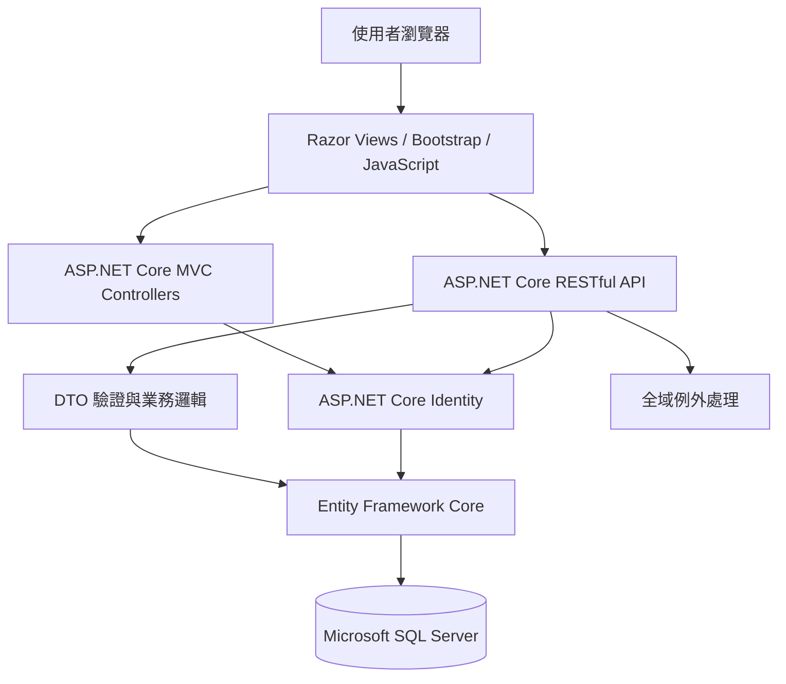

# MiniERP 系統架構圖

```mermaid
flowchart TD
    A["使用者瀏覽器"] --> B["Razor Views / Bootstrap / JavaScript"]
    B --> C["ASP.NET Core MVC Controllers"]
    B --> D["ASP.NET Core RESTful API"]
    C --> E["ASP.NET Core Identity"]
    D --> F["DTO 驗證與業務邏輯"]
    D --> E
    F --> G["Entity Framework Core"]
    E --> G
    G --> H[("Microsoft SQL Server")]
    D --> I["全域例外處理"]
```